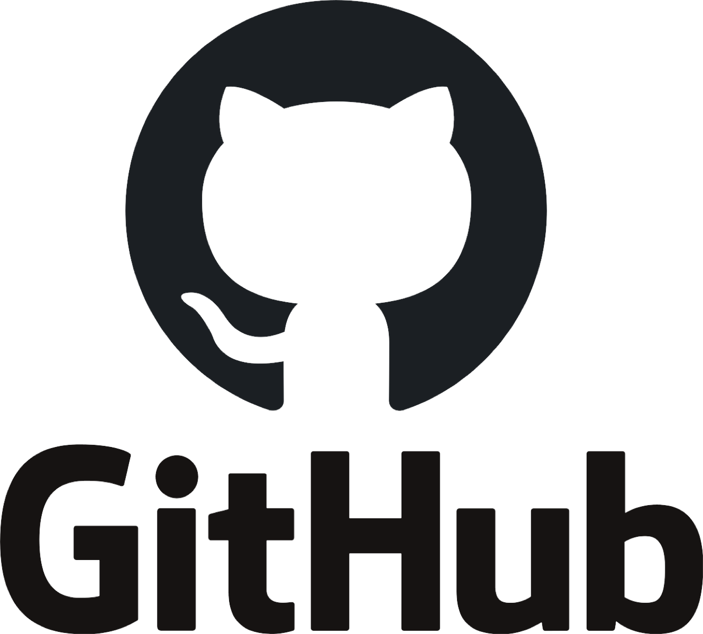
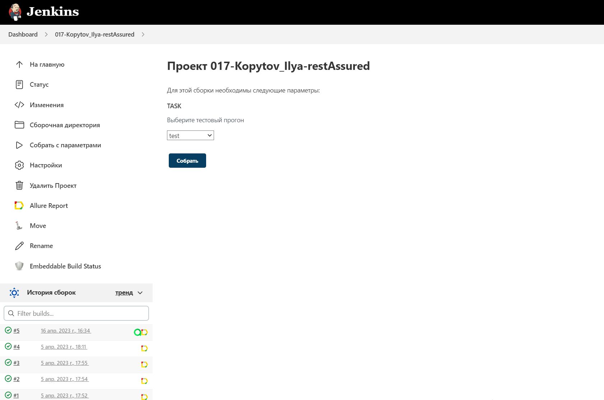
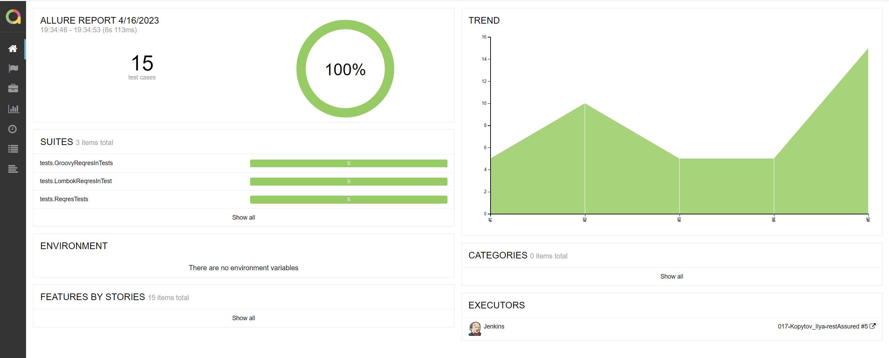
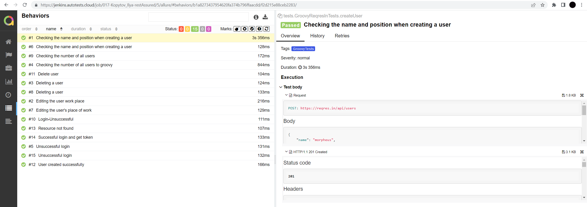
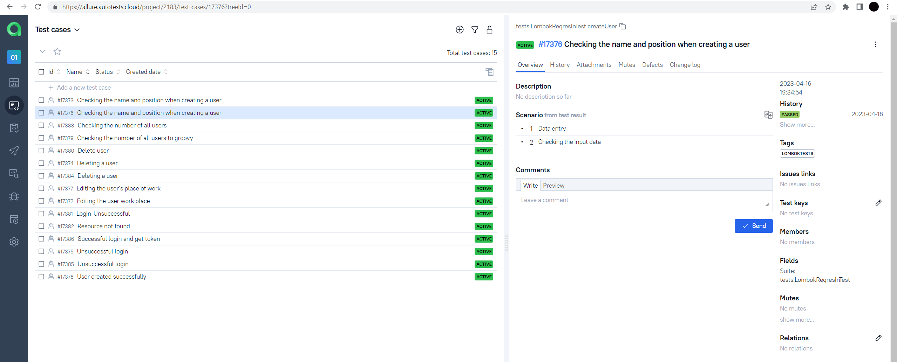
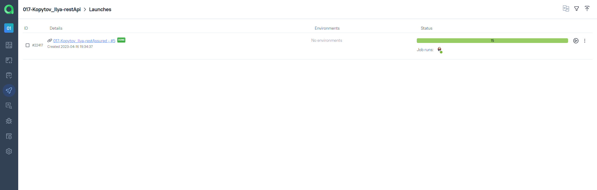
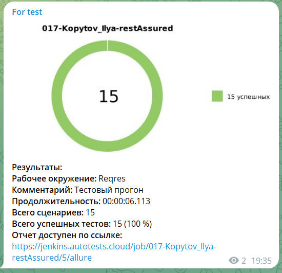

<h1 >Проект автоматизации UI для сайта <a href="https://reqres.in">reqres.in</a></h1>

<br>
<p align="center">

</p>
<br>

## Содержание

* <a href="#tools">Технологии и инструменты</a>
* <a href="#cases">Реализованные проверки</a>
* <a href="#console">Запуск тестов из терминала</a>
* <a href="#jenkins">Запуск тестов в Jenkins</a>
* <a href="#allure">Отчеты в Allure</a>
* <a href="#testops">Интеграция с Allure TestOps</a>
* <a href="#telegram">Уведомления в Telegram с использованием бота</a>

<a id="tools"></a>
## Технологии и инструменты

<p align="center">





  
 
   
   
</p>

Автотесты написаны на <code>Java</code> с использованием <code>JUnit 5</code> и <code>Gradle</code>.
Для API-тестов использована библиотека [RestAssured](https://rest-assured.io), [Lombok](https://projectlombok.org). ООП [Groovy](https://groovy-lang.org).

Также реализована сборка в <code>Jenkins</code> с формированием Allure-отчета и отправкой уведомления с результатами в <code>Telegram</code> после завершения прогона.

Allure-отчет включает в себя:
* выполнения тестов;
* api запросы;

<a id="cases"></a>
## Реализованные проверки

### Автоматизированные проверки
- [ ] User created successfully
- [ ] Resource not found
- [ ] Successful login and get token
- [ ] Delete user
- [ ] Unsuccessful login
- [ ] Checking the name and position when creating a user
- [ ] Checking the number of all users
- [ ] Editing the user's place of work

<a id="console"></a>
##  Запуск тестов из терминала
### Локальный запуск тестов

```
gradle clean run_tests 
```

### Удаленный запуск тестов

```
clean
test
tests_lombok
tests_groovy
```


<a id="jenkins"></a>
## Запуск тестов в Jenkins

> Сборка с параметрами позволяет перед запуском изменить параметры для сборки (путем выбора из списка или прямым указанием значения).

<p align="center">
</a>
</p>

<a id="allure"></a>
## :bookmark: </a> Добавление интеграции с Jenkins 
<a target="_blank" href="https://jenkins.autotests.cloud/job/017-Kopytov_Ilya-restAssured/"> job </a> 

### Основное окно

<p align="center">

</p>

### Тесты

<p align="center">

</p>

## :bookmark: </a> Добавление интеграции с Allure TestOps
<a target="_blank" href="https://allure.autotests.cloud/project/2183/dashboards">Dashboard</a>

### Тест-кейсы
<p align="center">

</p>

### Пример запуска тест-кейсов
<p align="center">

</p>

<a id="telegram"></a>
## Уведомления в Telegram с использованием бота

<p>

</p>
